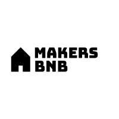

<div align="center" id="top"> 
  

&#xa0;

  <!-- <a href="https://makersbnb.netlify.app">Demo</a> -->
</div>

<h1 align="center">Makers BnB</h1>

<p align="center">
  

  

  

  <!--  -->

  <!--  -->

  <!--  -->
</p>

<!-- Status -->

<!-- <h4 align="center">
	🚧  Makers BnB 🚀 Under construction...  🚧
</h4>

<hr> -->

<p align="center">
  <a href="#dart-about">About</a> &#xa0; | &#xa0; 
  <a href="#one-mvp">MVP</a> &#xa0; | &#xa0; 
  <a href="#sparkles-features">Features</a> &#xa0; | &#xa0;
  <a href="#rocket-technologies">Technologies</a> &#xa0; | &#xa0;
  <a href="#white_check_mark-requirements">Requirements</a> &#xa0; | &#xa0;
  <a href="#checkered_flag-starting">Starting</a> &#xa0; | &#xa0;
  <a href="#memo-author" target="_blank">Authors</a>
</p>

<br>

## :dart: About

We developed a user-friendly web app for accommodation rentals. Users can log in, add rental spaces, book them, and receive quick booking confirmations.

## :one: MVP

##### Homepage

- Visit homepage.
- Click to see spaces.
- List available spaces.
- Button to book space.
- Remove space from the list.

## :sparkles: Features

:heavy_check_mark: User is able to Sign up and Log in using bcrypt;\
:heavy_check_mark: User is able to add a Space or Delete a space;\
:heavy_check_mark: User is able to book a space;

##### Features we would of like to do if we had more time:

- Throw error messages with email and password validation.
- Add a upload image so user can show an image of thier space.
- Add a date booking API to show when spaces are available.
- Add requests page.
- Use Rake to migrate database instead.

## :rocket: Technologies

The following tools were used in this project:

- [Ruby](https://www.ruby-lang.org/en/)
- [Sinatra](https://sinatrarb.com/)
- [PostgreSQL](https://www.postgresql.org/)

## :white_check_mark: Requirements

Before starting :checkered_flag:, you need to have [Git](https://git-scm.com), [Ruby](https://www.ruby-lang.org/en/) and [PostgreSQL](https://www.postgresql.org/) installed.

## :checkered_flag: Starting

```bash
# Clone this project
$ git clone https://github.com/robimaliqi/makers-bnb

# Access
$ cd makers-bnb

# Install gems
$ bundle install

# Set up database
$ psql
$ CREATE DATABASE makersbnb;
$ \c makersbnb;
# Run the commands in the db/migrations folder, in order.

$ psql
$ CREATE DATABASE makersbnb_test;
$ \c makersbnb_test;
# Run the commands in the db/migrations folder, in order.

# Run the project
$ ruby app.rb

# The server will initialize in the <http://localhost:4567>

# Running tests
$ bundle exec rspec
```

## :memo: Authors

Made with :heart: by :

-<a href="https://github.com/robimaliqi" target="_blank">Robi Maliqi</a><br> -<a href="https://github.com/davekempsell" target="_blank">Dave Kempsell</a><br> -<a href="https://github.com/MalikOJBS" target="_blank">Osman Saeed</a><br> -<a href="https://github.com/danielotf" target="_blank">Daniel Mbata</a><br>

&#xa0;

<a href="#top">Back to top</a>
